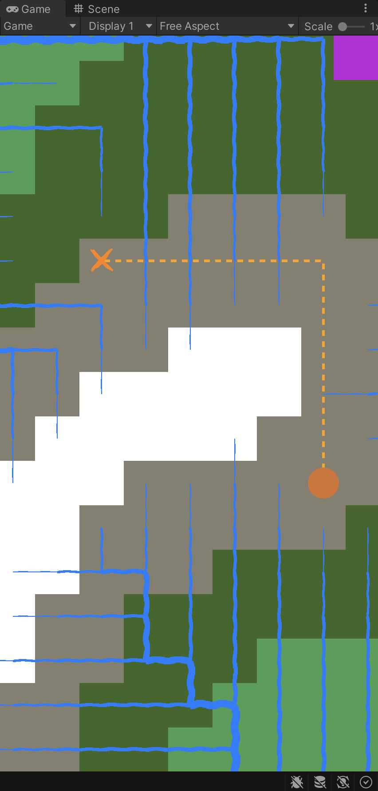
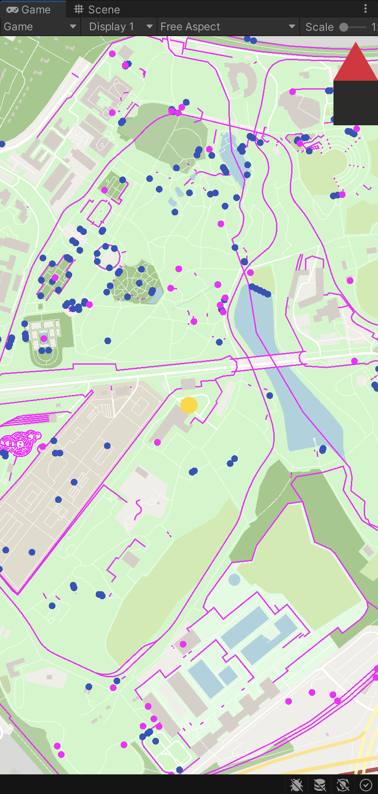

# Samples

These code samples are obviously incomplete and have bugs, some of which I know about. Some code goes back years but everything here is used in my latest projects.

## Project Creek

An exploration role-playing game with minimal ui. You decide what to do, more than how to do it.

### World map procedural generation

Some values could be precomputed, but that's for later.

1) [Running a pattern pass](WorldMap.cs#L251-L281)
2) [Creating a pattern mask](WorldMapNode.cs#L13-L23)
3) [Rotating the mask](SystemExtensions.cs#L93-L96)

### Traversing a map

- [A* pathfinding](RingMap.cs#L340-L419)

### Creating seamless tileable noise

- [libringnoise](https://github.com/asciibeats/libringnoise/blob/master/src/ringnoise.c#L200-L213)

## Project Schnitzel

A geolocation-based game using among other things [OpenStreetMap data](https://download.geofabrik.de/europe/germany/nordrhein-westfalen/duesseldorf-regbez.html), [Mapbox's MVT format](https://github.com/mapbox/vector-tile-spec/tree/master/2.1), [Google's Protocol Buffers](https://protobuf.dev) and [PostGIS](https://postgis.net/)

### Example rendering of [Grugapark Essen](https://www.openstreetmap.org/#map=16/51.4278/6.9873)

Small dots are amenities. Pink stuff has no style yet.

### Decoding and rendering the data
- [Converting MVT data](TileData.cs)
- [Rendering a line](Line.cs)

## Project Flick

Online multiplayer dexterity board game in space. Gather resources, upgrade your faction and use your surroundings to your advantage, gravity included. Physics calculations run on both, the client and the server. On the server for a single source of truth and on the client to make the game more responsive.

https://github.com/asciibeats/samples/assets/2955162/1c48b68c-d678-4cff-af03-fdb2cd60f708

